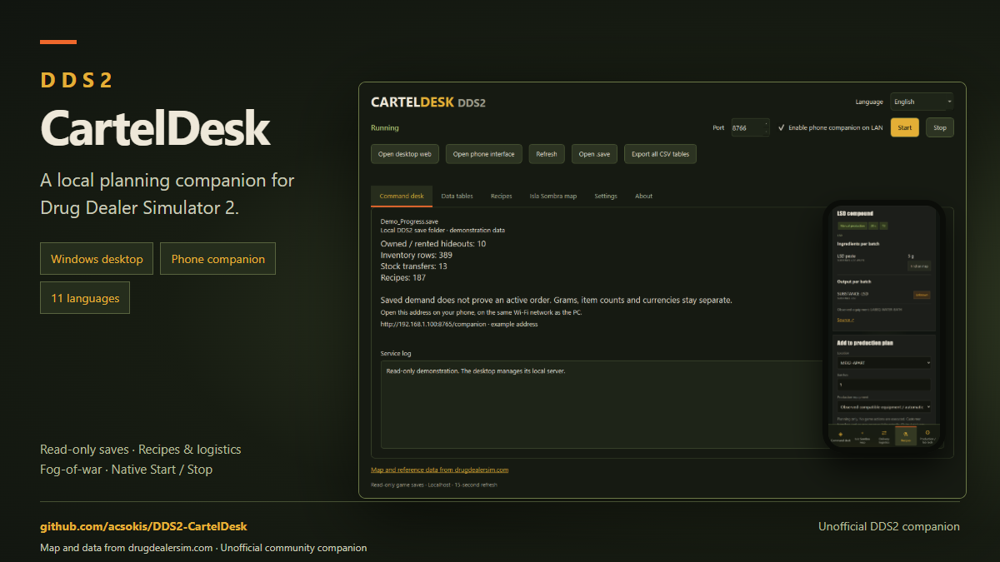
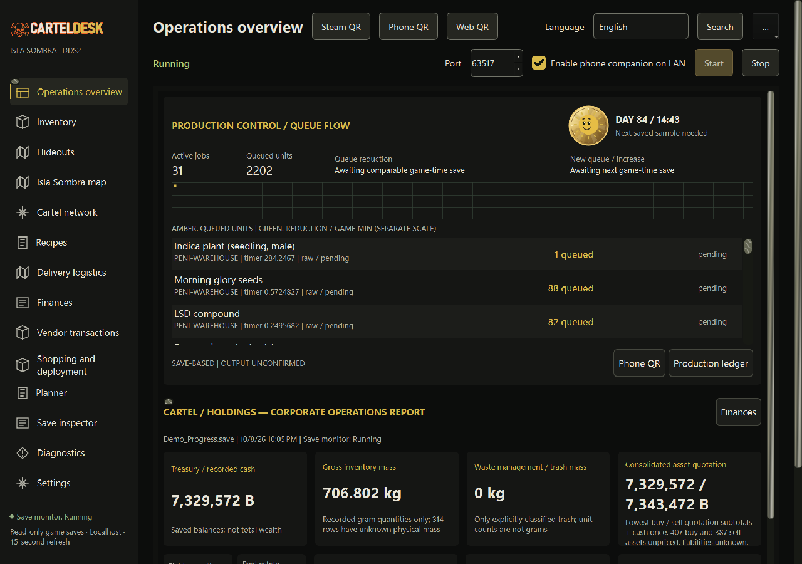
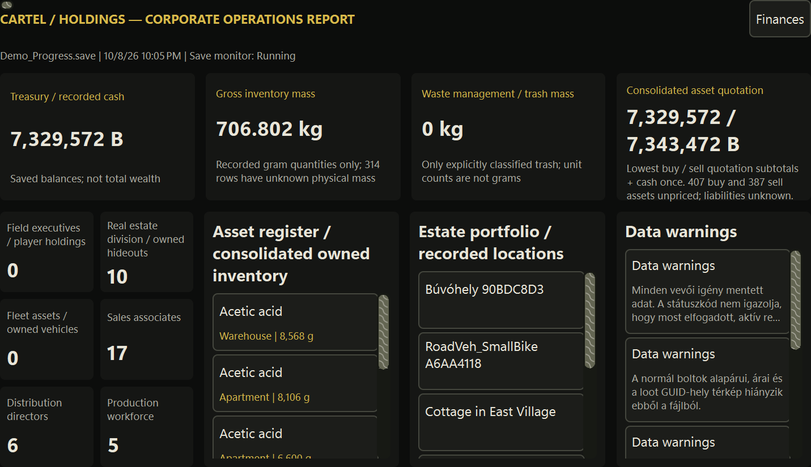
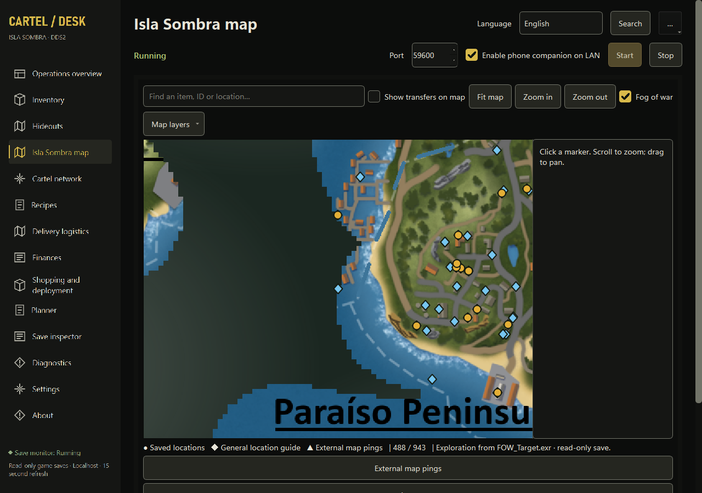
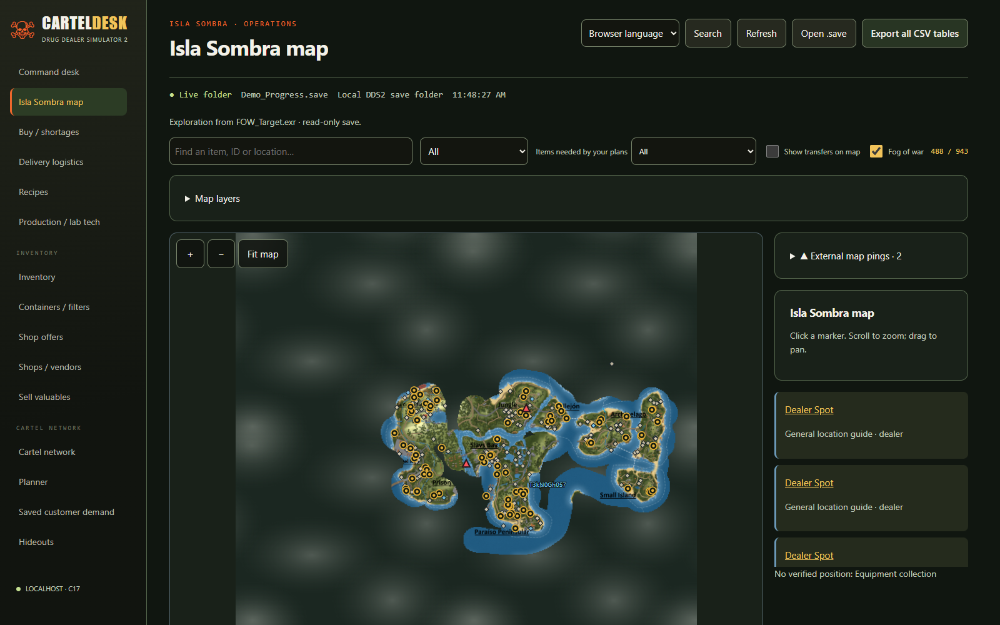
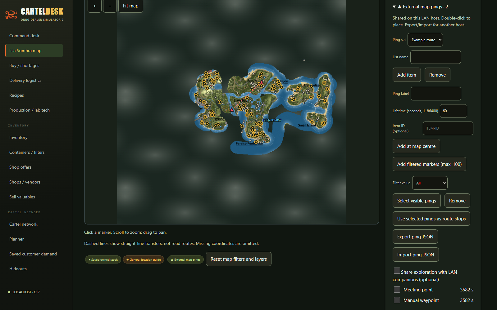
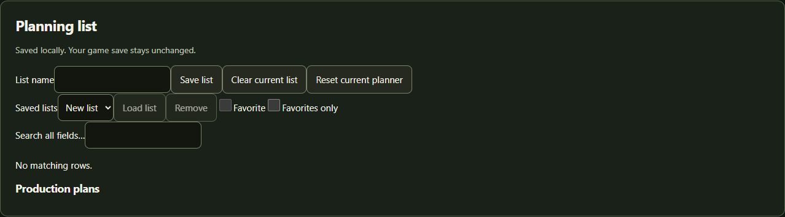
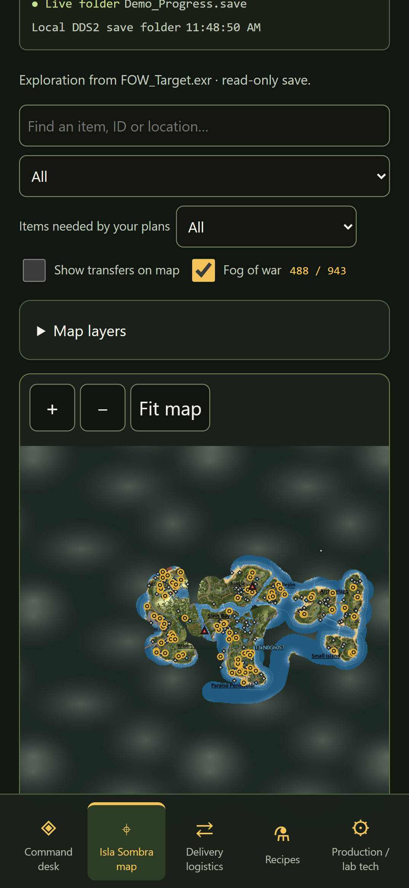


# DDS2 CartelDesk

A free, unofficial Windows planning desk for Drug Dealer Simulator 2. Read your campaign, find ingredients and equipment, organise stock and routes, and open the same tools on your phone.

**[Download the latest Windows release](https://github.com/acsokis/DDS2-CartelDesk/releases/latest)** · [Screenshots and posting material](media/README.md)

Only the latest release is public. This repository distributes the application and media; the application's source code remains private.

## Start on Windows

1. Extract the complete Windows x64 ZIP into a writable folder.
2. Start **CartelDesk.exe**. The window manages its own background service with Start and Stop; closing it also stops its service.
3. Select your DDS2 cartel folder or choose an individual Progress save. The normal location is under LocalAppData/DrugDealerSimulator2/Saved/SaveGames/Cartels.
4. Keep the companion open while playing, then refresh after the game finishes saving.

The release root contains the launcher, README, configuration and optional network helper. Qt and native libraries stay in **runtime/**; web assets in **web/**; notices and corresponding Qt source archives in **licenses/**. Keep these folders beside the launcher.

Game saves and sidecar files are read only. There is no automatic campaign import or overwrite.

## Desktop and phone

The C17 service parses and plans locally; the C++ desktop uses Qt Quick navigation and Operations views alongside native Widgets. The localhost web UI and portrait companion use the same saved facts.

For a phone, enable private-LAN companion mode, start the service and select the Wi-Fi IPv4 address in Command Desk. Scan its QR code; click it to open a larger, resizable QR window. The phone and PC must be on the same local network. Windows may require the supplied ENABLE_COMPANION_NETWORK.ps1 helper for its private-network firewall rule.

Responsive layouts keep text sharp as windows resize. Motion is optional and the browser's reduced-motion preference is respected. The phone layout is intended for modern portrait displays, including Galaxy S22 Ultra class screens. A physical phone has not yet been verified.

The browser language is the initial web preference and the system language is the desktop default. English, German, Spanish, French, Hungarian, Polish, Ukrainian, Russian, Czech, Serbian and Croatian are available.

## What you can do

| Area | Saved facts and controls |
| --- | --- |
| Operations | Loaded campaign, recorded money in Bolivars (B), own stock, missing requirements and transfers |
| Inventory | Items, substances, equipment, quantities and distinct installed, collection, player, staff and stored contexts |
| Cartel Network | Saved hideouts, distributor desks, distributors, dealers, workers and assignments; missing or conflicting links stay unresolved |
| Recipes | Recorded ingredients and quantities, available equipment alternatives and scaled batches; unknown requirements stay unknown |
| Planner | Acquire, store, produce and transport; recorded prices, quantities, capacities and straight-line distances |
| Planning lists | Add, edit quantities, remove, filter, save/load/delete named lists and mark favorites |
| Map | Game map, persistent legend and counts, stock/source search, layers, Locate, optional routes and reference ranges |
| External pings | Red triangles, sets, batch additions, multi-select deletion, seconds-based expiry and manual route stops |
| Save Inspector | Technical IDs, complete tables, parser metadata, search, filters and CSV/ZIP exports |

**Owned inventory and Acquisition sources are separate.** Finding no owned ethanol does not end the supplier search. Recipe requirements show known vendors, storage contexts and coordinates independently of your own quantity. Recorded coverage does not promise unreserved stock. Quantities in incompatible units are never summed.

The current planning list is separate from saved named lists and production targets. Add a recipe's ingredients and non-alternative tools to the draft, edit amounts or mark them unknown, then save a named list. Choose alternative equipment individually. Reset clears the draft and planner filters while retaining named lists; each production plan can be removed separately.

## Actual game exploration

Terrain fog uses **FOW_Target.exr from the selected cartel folder**. Its HALF RGB channels contain the exploration mask; constant alpha is ignored. The previous circle, bridge and hull estimate has been removed from both desktop and web.

If the file is missing, invalid or unsupported, the terrain stays covered and the interface explains why. The **Fog of war** checkbox can show the terrain without writing any game file. Turning it off does not unlock hidden inventory, recipes or unverified locations. An uploaded Progress save has no accompanying mask unless you select its local cartel folder.

**Sharing exploration with LAN companions is optional and off by default.** Localhost and desktop can use the host's mask. A LAN client receives no mask while sharing is disabled. Known saved places still have useful markers. Use Reset map filters and layers if a search or an old layer preference hides results.

The three adjacent files serve different purposes: CartelDefaults.sav stores cartel configuration and assignments, CartelLocalData.sav stores local hints and favorite settings, and FOW_Target.exr is an image. They are not the LootPoolDatabase DataTable. The [wiki identifies LootPoolDatabase as a game DataTable source](https://drugdealersim.com/wiki/dds2/clothing-apparel); a campaign's dynamic loot state is different from the build's static loot definitions. Missing chances, quantities and prices stay unknown.

## External pings and manual routes

Open **External map pings**, create a set and choose a lifetime from **1 to 86400 seconds**. Add at the visible map centre, double-click to place a ping, or add up to 100 filtered markers at once. Filter by set, select one or multiple pings and remove them. The workspace supports 30 sets and 200 active pings.

Browsers and desktop connected to the **same running LAN host** share additions/removals and expiry with a two-second poll. For a separate host, explicitly export/import the ping JSON packet; imported pings retain only their remaining lifetime. Invalid batches are rejected before the workspace changes.

Recipe and planner pages can show ping stops on their map. These are manual, straight-line routes and external annotations. They do not claim road navigation, owned inventory, available supplier stock or live player positions.

Encrypted peer sessions, a live WebRTC delta stream and full-save transfer are **not yet connected to the released app UI**. The standalone Windows transfer transaction passes parser, verification, backup and atomic-replace tests; network send/receive UI and crash recovery remain pending. This release never sends or replaces a campaign file.

## Screenshots

These are actual desktop, localhost and portrait captures from a demonstration campaign. Paths and adapter details are removed from the presentation.

 

## Data, credits and limitations

**Map and reference data from drugdealersim.com** — [live wiki](https://drugdealersim.com/).

About and posting credit: **Map and data from drugdealersim.com**. Branding credit: **Sourced from drugdealersim.com**.

CartelDesk is not endorsed by or affiliated with drugdealersim.com, TGS, ByteRunners or Movie Games SA. Underlying game data belongs to the game's developers. Wiki permission covers its map render and curation; contributed guide prose is not bundled. References are an offline snapshot under review: use the live wiki for current values. Currency is Bolivars (B).

The icon is an original CartelDesk mark. Third-party and Qt notices, dynamic-linking information and corresponding source archives accompany the package. The application's own source is private.

By **Gábor Kocsis (acsokis)**: [GitHub](https://github.com/acsokis) · [Instagram](https://www.instagram.com/gabor_carter/) · [LinkedIn](https://www.linkedin.com/in/gabor-web/).

Development uses C17/C++17, an existing save parser, a bounded EXR decoder, responsive web views and local Windows/browser verification. AI-assisted implementation and review are described in About. Unknown game facts are never filled with guessed values.

The maintained design catalog contains **131 unique active acceptance points** plus shared constraints, after deduplicating historical requests. That count is a scope catalog, not a claim that every experimental multiplayer or recovery requirement is complete. Hardware-specific FPS, physical-phone, assistive-technology and full progression coverage remain pending.

## Quick start summary

Extract the entire ZIP and launch **CartelDesk.exe**. Start, Stop and closing the window manage its owned background server. Select your cartel folder. Map exploration comes from **FOW_Target.exr**; fog has a view toggle and optional LAN sharing. For your phone, enable companion mode, select the Wi-Fi IP address and scan the QR code. Red pings are shared by clients on the same LAN host; independent hosts use JSON export/import. Game saves are read only.

## Procurement and courier planning preview — 2026-10-08

Planner and recipe requirements now include map reference acquisition sources, with general same-name item variant matching. Reference stock and prices remain unknown; owned quantities retain exact IDs and units. Saved player positions support selectable couriers and multiple owned hideout endpoints. The map displays pickup/delivery legs. This is a greedy straight-line planning estimate requiring stock verification, not road pathfinding or confirmed availability. Details: [supply planning](docs/SUPPLY_CHAIN.md). Included in v1.1.1.

Previous layout update (v1.1.1): independent viewport scrolling in desktop navigation and content; readable recipe rows and wrapping action controls; visible source-to-target network arrows outside the fog mask; acquisition references matched across same-name item variants; saved courier positions and selectable hideout destinations for pickup/delivery planning. Quantities and prices absent from the reference remain unknown. Courier routes are greedy straight-line estimates, not road navigation or confirmed live player positions. Map and reference data from drugdealersim.com (https://drugdealersim.com). No endorsement or affiliation with TGS, ByteRunners or Movie Games SA.

## Buyer evidence update ? 2026-10-08

Vendor sells/buys labels use the vendor viewpoint. A searchable buyer catalogue includes Tom the Tech?s twelve screenshot-confirmed tool quotations and Alejandro Flores?s user-reported empty bottle acceptance with unknown prices. Owned inventory is independent of acceptance. Unverified catalogue quotations stay marked unverified; unknown buyer locations do not create map pins. See [buyer evidence and limitations](docs/BUYER_EVIDENCE.md).

## Desktop production telemetry

Operations now uses a compact production instrument above full-width corporate KPI grids. It measures tracked queue reductions/increases and raw timer movement per game minute across comparable saves. The first sample stays unresolved; disappearing jobs do not become confirmed output. Compact phone pairing is available through Phone QR. Scanner motion follows the Animations preference. [Data interpretation and limits](docs/PRODUCTION_TELEMETRY.md).

The desktop, web and phone wordmarks now carry a soft skull-orange outline that flows in both directions. Animation can be disabled. [Brand motion](docs/BRAND_MOTION.md).

## Golden-ratio responsive sizing

Desktop, web and phone layouts use a shared golden-ratio spacing and modular type hierarchy, with bounded scaling and readable minimum sizes. Existing animations and colors remain. [Sizing rules and practical limits](docs/GOLDEN_LAYOUT.md).

Operations detail panels use three equal columns for owned inventory, saved locations and data warnings, each with an independent bounded scroll area. Very narrow content below 600 pixels stacks the panels. Unchanged production samples show explicit states (no queue reduction, no new work, or timers changing) instead of a misleading zero-per-minute readout. Numeric zero remains available to the measurement logic; positive observed rates retain their game-minute units. A green reduction curve appears only after a positive reduction is recorded.

## Cartoon game clock

The desktop production instrument includes a scalable circular sun/moon character. Daytime is 06:00?18:00. A daily sun break starts at 16:20 and a moon break at 04:20, lasting 20 saved game minutes: two minutes of comic ignition, sixteen of smoking with drifting embers, and two of stubbing out. These are decorative scenes; their stage follows saved game time without inventing live clock progress. Animation preferences disable movement, leaving a static time-appropriate illustration. Missing game time shows an unresolved clock. Drawing uses a small vector canvas with a 15 FPS timer active only on the visible Operations page.

The cartoon clock adds elastic squash/stretch, blinking and expressive eyebrows, exaggerated puffed cheeks, drifting smoke rings, ignition sparks and a comic stub-out impact. Its original sun/moon characters retain the existing colour palette, saved-time schedule and animation-off behaviour.

The sun uses a gold dial and the moon a silver dial, each with a light-to-dark metallic gradient, hour ticks and slowly rotating radial decoration. Rotation follows the animation preference.

The animated dial sits directly beside the saved day/time label in the production header, with the timer observation status on a separate line. The sun and moon switch with saved daytime/nighttime.

When saved game time is unavailable, a decorative sun/moon coin-spin and trick handoff runs after a random 7?13 minutes spent on the visible Operations page with animations enabled. Each eight-second scene alternates the recipient: sun to moon, then moon to sun. Disabling animation or leaving the page cancels an active scene and pauses its waiting countdown. The clock label stays unavailable; this does not invent game time.

## v1.1.2 ? Operations layout and connection drawers

Operations panels grow with the window height. The production queue has taller rows and a larger scroll area. Six executive metrics use two columns and three rows beside three independently scrollable detail panels on wide windows, with stacked groups on narrower windows. Damascus scrollbars have wider handles. Web, Phone and Steam QR buttons open a motion-aware unfurling connection drawer; links retain the chosen LAN IP, while Steam uses loopback with an optional global web-content opacity control. The selected map location is raised above co-located NPC markers.

The existing saved-time sun/moon scenes and unavailable-clock trick handoffs remain included. Shared inventory transfers and a dedicated Mission view are not implemented in this version. The app remains a read-only game-save companion; planning does not move in-game items.

An observed advancing saved-time day/night change triggers a 32-second decorative coin-spin and trick handoff (moon to sun at dawn, sun to moon at dusk). Daytime boundaries remain 06:00 and 18:00; the 04:20/16:20 scenes remain unchanged. Missing clocks, repeated saves and time rollback do not trigger this transition. The game-time label is not extrapolated; only the decorative scene uses a 30 FPS presentation timer on the visible Operations page. Unknown-clock fallback remains separately scheduled.
