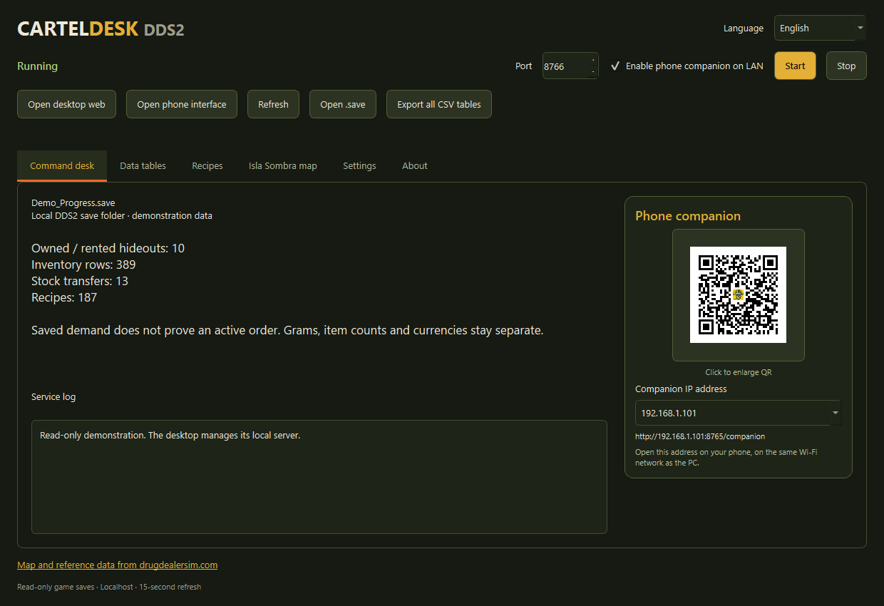
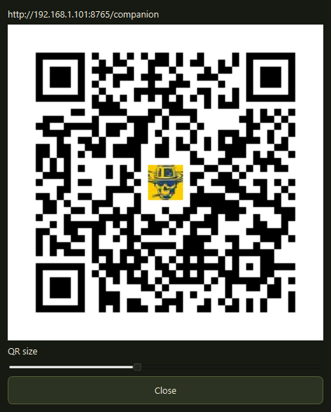
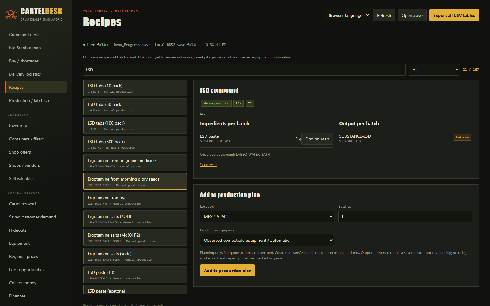
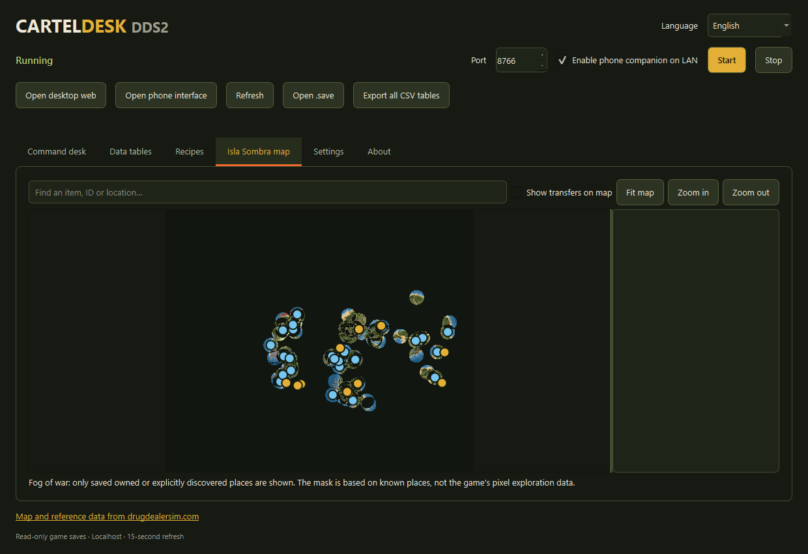
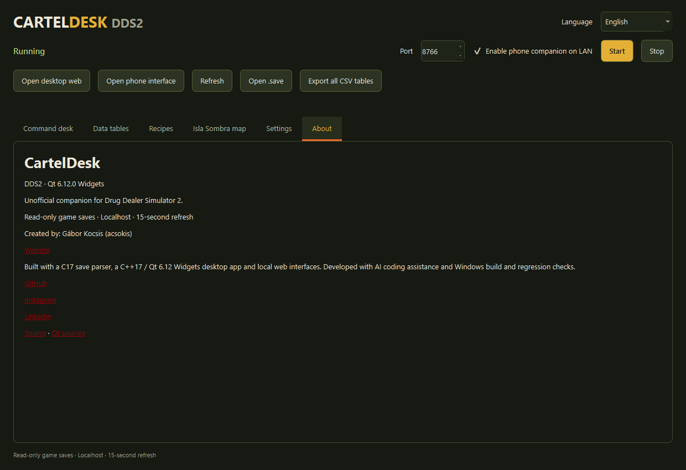
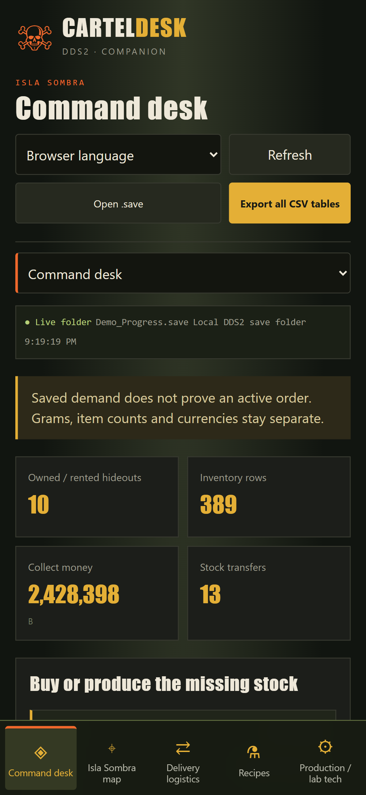
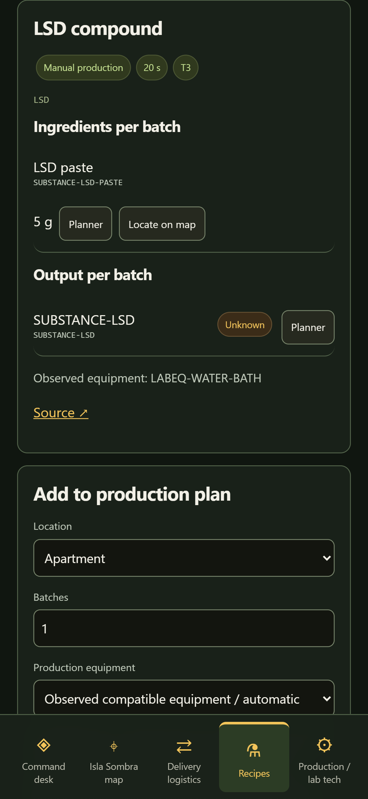

# DDS2 CartelDesk

**Your local planning desk for Drug Dealer Simulator 2.** Read your save, check ingredients and equipment, organise stock transfers, and keep the same tools beside you on your phone.

[**Download for Windows x64**](https://github.com/acsokis/DDS2-CartelDesk/releases/latest) · [Screenshots](#screenshots) · [Media & post kit](#media--post-kit) · [Report an issue](https://github.com/acsokis/DDS2-CartelDesk/issues)

## Get started

1. Download **DDS2-CartelDesk-v1.0.1-Windows-x64.zip** from Releases.
2. Extract the entire ZIP into a writable folder. Keep its runtime, web and licenses folders together. CartelDesk.exe is the only executable in the top-level folder; DLLs and the backend are grouped in runtime/.
3. Open **CartelDesk.exe**. The native window starts its own local server.
4. Use **Start / Stop** to control the server. Closing the window stops its server.

Designed for Windows 11 x64. No installation, command window, Node.js, Python or separate Qt installation is required. The application is a separate planning tool; it does not execute game actions.

The default save folder is:

`%LOCALAPPDATA%\DrugDealerSimulator2\Saved\SaveGames\Cartels`

CartelDesk finds the latest cartel folder. Choose another folder or .save in Settings. Game saves are **read-only**. Plans and preferences are stored separately in config.json and desktop.ini.

## What you can do

| Feature | Behaviour |
| --- | --- |
| Native desktop | Qt 6.12 Widgets window, managed Start / Stop, searchable tables and settings |
| Recipes | 187 documented recipes with ingredients, saved production equipment and laboratory workstations |
| Production planning | Reserve customer demand first, allocate stock once, calculate missing materials and share saved storage capacity |
| Logistics | Saved distributor assignments, transfers, orders and straight-line distance estimates |
| Game map | Isla Sombra map with discovery-based fog-of-war, known locations and ingredient lookup |
| Phone companion | Portrait web interface with the same save data, recipes, map and plans |
| Export | Filtered CSV and all-table CSV ZIP |
| Languages | English, German, Spanish, French, Hungarian, Polish, Ukrainian, Russian, Czech, Serbian and Croatian |

Desktop language follows the system; web language follows the browser. The language menu overrides automatic selection.

## Phone companion

Enable **phone companion on LAN** in the native window. Connect your phone to the same Wi-Fi as the PC and open the private-IP **/companion** address shown in the window. The desktop web interface is also available at http://127.0.0.1:8765.

The phone uses the PC's displayed IP address: localhost on the phone refers to the phone itself. Keep the PC application running. The portrait interface targets modern high-resolution phones such as the Galaxy S22 Ultra.

If Windows blocks incoming connections, run the optional **ENABLE_COMPANION_NETWORK.ps1** as administrator. It adds a private-network, local-subnet rule for port 8765. Public Internet clients are rejected; this is a local-network companion.

## Fog-of-war and data limits

Fog-of-war is enabled in the native app, desktop web and phone companion. It reveals neighbourhoods around places explicitly discovered or owned in the save. Undiscovered catalogue markers stay hidden, and a nearby known position does not unlock another marker.

The mask uses saved discovery flags and coordinates; it is **not the game's pixel exploration mask**. Unknown coordinates, prices, recipe yields and equipment compatibility remain unknown. Public shop/loot information describes possible locations, not current stock. Transfer lines are straight-line estimates, not verified road routes. Saved demand does not prove an active order.

## Companion QR and server lifecycle

Enable companion access and start the service. In the upper-right companion card on the Command Desk tab, choose the local IP address of the adapter shared with your phone, then scan its QR code. Click the QR card to open a larger window and use the size slider; closing it leaves the card in its original place. The chosen address is remembered. The phone and PC must share a private network, and Windows Firewall must allow companion access. QR codes are generated locally, without sending the URL to an external service.

The backend runs in the background while the desktop is open. Stop ends the owned server; closing the desktop also stops it. A parent-process watcher terminates the server if the desktop is forcibly terminated, even during an incomplete network request.

## Screenshots

These are actual application captures using demonstration save data. Local filesystem paths and adapter addresses have been removed from the presentation. The visible map remains behind fog-of-war.

**Windows desktop**

**Enlarged companion QR**

**Recipes and equipment**

**Discovery-based map**

**About and wiki credits**

**Phone companion**

## Media & post kit

[Open the media kit](media/README.md) or download **DDS2-CartelDesk-v1.0.1-Media.zip** from [Releases](https://github.com/acsokis/DDS2-CartelDesk/releases/latest).

It contains original screenshots, a 1200 × 675 wide cover, a 1080 × 1080 square cover, and ready-to-copy English posts for **Steam Discussions**, **LinkedIn**, and **Nexus Mods / Vortex**. These are posting drafts; they have not been posted to those platforms.

For Nexus Mods, describe CartelDesk as a standalone utility and use manual download/extraction. The package is not a Vortex game extension or an automatic game-folder deployment mod.

## Credits and source

Created by **Gábor Kocsis (acsokis)** — [GitHub](https://github.com/acsokis) · [Instagram](https://www.instagram.com/gabor_carter/) · [LinkedIn](https://www.linkedin.com/in/gabor-web/).

Built with a **C17 save parser**, **C++17 / Qt 6.12 Widgets**, and local **HTML/CSS/JavaScript** interfaces. AI coding assistance, Windows builds and regression checks supported development. Unofficial DDS2 companion; not affiliated with the game's creators.

This repository publishes release information and media. **The application's C/C++ source and development files are not published.** The download includes the browser runtime assets needed by its web interfaces. GitHub's automatic “Source code” archives contain this public documentation repository, not the native application source.

Qt is dynamically linked. The licenses folder includes its original license texts, SBOM and the corresponding unmodified Qt 6.12.0 source archive. That archive contains third-party Qt source, not CartelDesk's private source. Keep it and THIRD_PARTY_NOTICES.txt with the distribution.

Game reference data: [Isla Sombra map](https://drugdealersim.com/map), [recipes](https://drugdealersim.com/wiki/dds2/crafting-recipes), [items](https://drugdealersim.com/wiki/dds2/all-items-catalog), [equipment](https://drugdealersim.com/wiki/dds2/hideout-equipment).

## Validation

37 automated Windows checks passed on Windows x64, including parser compatibility, stock allocation, capacity, read-only saves, Unicode, private-LAN access, 11 languages, recipe planning, fog-of-war markers, CSV ZIP integrity, and the real Qt Start / Stop lifecycle, normal/forced desktop closure during a partial HTTP request, and QR decoding from the actual card and enlarged images. Desktop web and portrait companion screenshots were also checked for JavaScript errors and horizontal overflow. Physical-phone touch testing has not been performed.

## Magyar gyorsindítás

Töltsd le a Windows ZIP-et, csomagold ki teljesen, és indítsd a **CartelDesk.exe** fájlt. A Start / Stop gomb vezérli a háttérszervert; az ablak bezárása leállítja. A program a valódi DDS2 mentési mappát keresi, és a játékmentést kizárólag olvassa. Telefonon ugyanazon a Wi-Fi-n az ablakban megjelenő /companion címet nyisd meg. A felületen magyar nyelv is választható.

## Wiki attribution and updates

[Map and reference data from drugdealersim.com](https://drugdealersim.com/)

Map and data from drugdealersim.com

Unofficial companion. Not endorsed by or affiliated with drugdealersim.com, TGS, ByteRunners or Movie Games SA.
Reference data checked 2026-10-06; visit the live wiki for current data during its ongoing audit. Currency: Bolivars (B).

The wiki operator permits bundling and screenshots of its map render and curation with attribution. This permission does not license the underlying game developer rights or contributed guide prose. No Steam-imported guide text is bundled. The reference snapshot is due for review on 2026-10-20; this is a planned maintenance date, not an automatic synchronization. If the wiki operator requests removal of its materials, those materials will be removed from the distribution.

Official DDS2 icon: sourced from the [game’s Steam community page](https://steamcommunity.com/app/1708850/), used as the Windows application/browser icon and in the QR centre. QR codes use high error correction; both the displayed card and enlarged output are checked by decoding. The artwork belongs to its respective rights holders. Wiki permission covers its map and curation, not game artwork or underlying game IP; no endorsement is implied.
