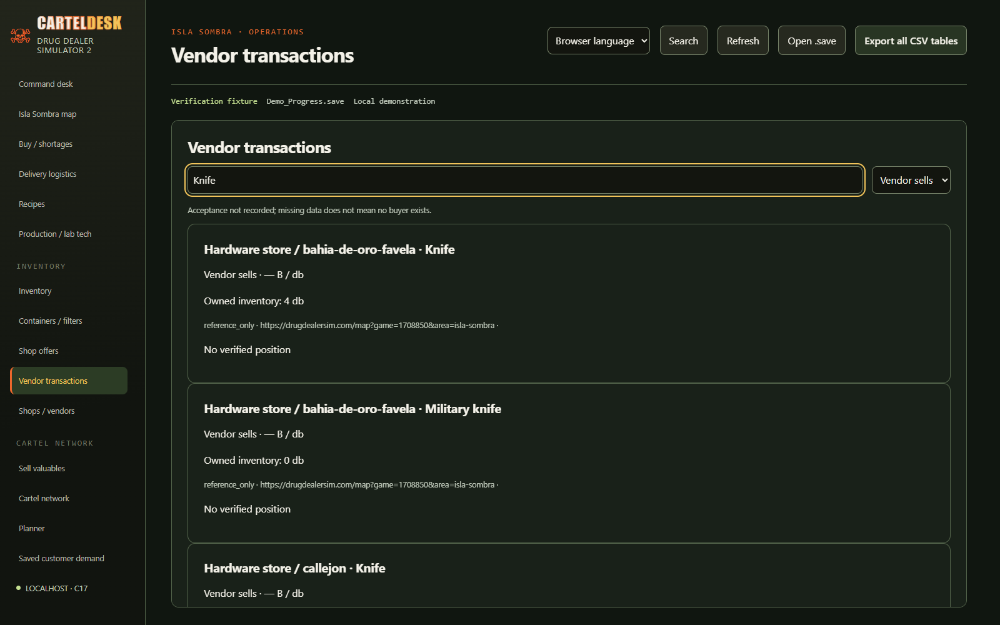
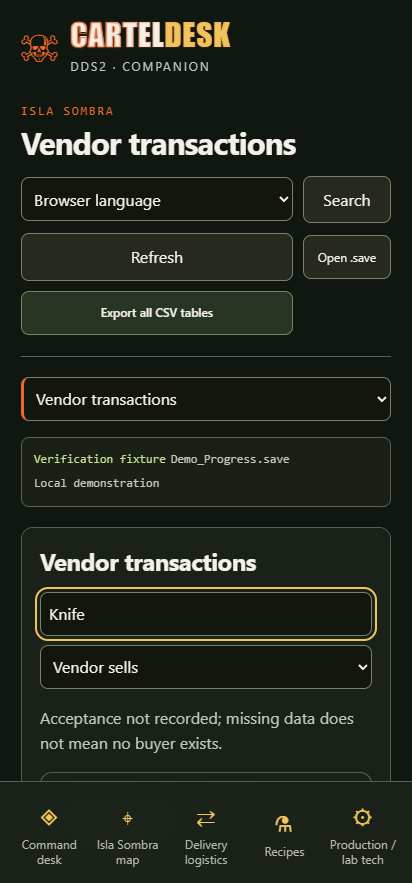

# Where to buy and sell an item

Open **Vendor transactions**, enter an item name or game item ID, and select **Vendor sells** to buy from that vendor or **Vendor buys** to sell to that vendor. These labels always use the vendor's viewpoint. A vendor can appear in both lists when each direction is independently supported.

The same seller catalogue feeds acquisition searches, recipe requirements and shopping lists. Owned inventory is separate: having none does not remove possible sellers. Catalogue availability is reference data, not a guarantee of current stock, reputation unlocks or today's price.

Catalogue names remain searchable before discovering the store. Undiscovered catalogue coordinates stay unavailable unless spoilers are explicitly enabled. The map lists matching unplaced sellers and buyers as text instead of creating invented pins. Broad vendor and unplaced-map lists show the first 100 matches plus the total; refine the query or use the CSV for the full catalogue. Explicitly hidden entities remain excluded.

For Knife, the verified catalogue contains six seller locations and the supplied Tom the Tech screenshot establishes buyback at 800 B per piece. Military knife is a separate item. Alejandro Flores bottle acceptance comes from the user report; its price and location remain unknown. A resale price on its own does not establish acceptance.

The sortable [item trade catalogue](ITEM_TRADE_CATALOGUE.csv) contains the bundled wiki's verified seller rows and separately evidenced buyer observations, with vendor, region, item ID, direction and provenance. Open it in Excel or another CSV viewer. `UNKNOWN` is intentional; unresolved name-only offers remain visible in this reference file rather than receiving a guessed ID. Buyer coverage is incomplete.

Map and reference data from [drugdealersim.com](https://drugdealersim.com). Consult the live site for updated information. No endorsement or affiliation is implied.

## Installed game data limitation

The supplied installation contains PAK plus IoStore UTOC/UCAS containers. Merely finding these files does not decode their Unreal DataTables. This change uses the already bundled curated catalogue and supplied buyer evidence; it does not claim successful direct extraction of every installed ShopDatabase or LootPoolDatabase row. A supported, version-compatible reader is still required for that independent extraction path. Game files and saves are read-only.

### Vendor lookup screenshots

